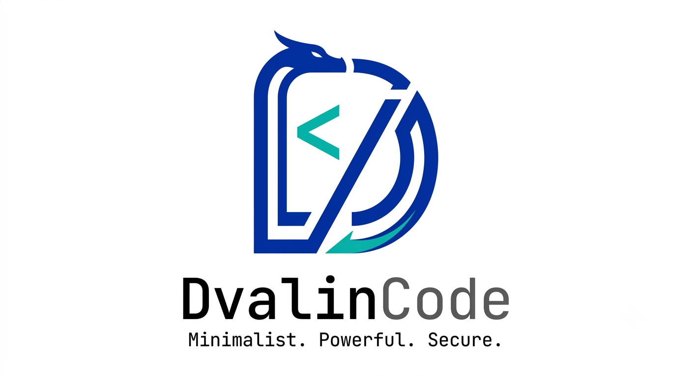
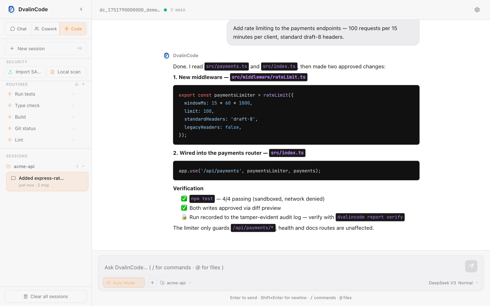
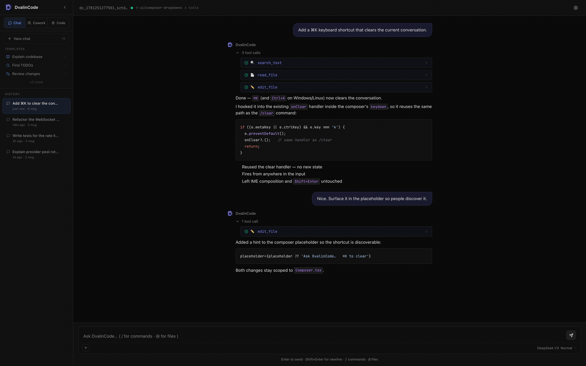
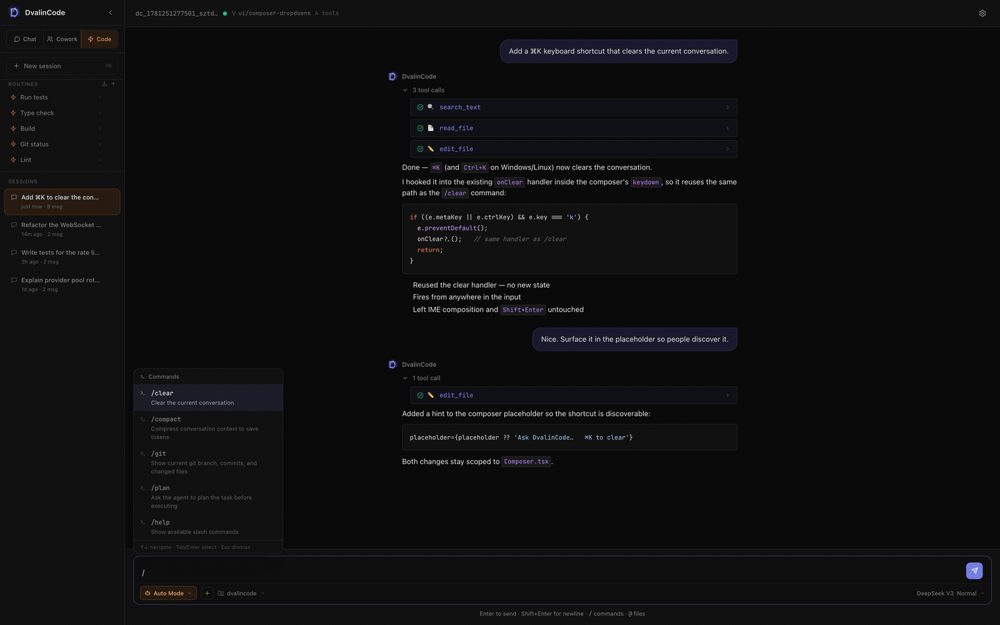

<p align="center">
  
</p>

<p align="center">
  <b>English</b> · <a href="README.zh-CN.md">中文</a>
</p>

<p align="center">
  <a href="https://github.com/arthurpanhku/dvalincode/releases/latest"></a>
  <a href="https://github.com/arthurpanhku/dvalincode/releases"></a>
  <a href="#-tests"></a>
  <a href="LICENSE"></a>
  <a href="https://scorecard.dev/viewer/?uri=github.com/arthurpanhku/dvalincode"></a>
  <a href="docs/governance/ISO-42001-AIMS.md"></a>
  <a href="docs/EVIDENCE-PACK.md"></a>
  <a href="docs/security/OPENSSF-SCORECARD.md"></a>
  <a href="#-quick-install"></a>
  <a href="#-providers"></a>
  <a href="README.zh-CN.md"></a>
</p>

<p align="center">
  <b>The approvable coding agent for regulated teams.</b><br>
  <b>Built for finance, healthcare, and security-sensitive engineering where AI coding must be controllable, transparent, and auditable.</b>
</p>

<p align="center">
  <b>🔑 Any model · local-first · policy-bound · audit-ready — the agent your security team can actually approve.</b>
</p>

<p align="center">
  Bring your own model — DeepSeek, OpenAI, Claude (via OpenRouter), Groq, Ollama, or any OpenAI-compatible endpoint. Switch with one click, no code changes, no lock-in.
</p>

---

## ⏱️ 60 seconds to proof

Don't take the claims on trust — verify them on your own machine:

```sh
curl -fsSL https://raw.githubusercontent.com/arthurpanhku/dvalincode/main/scripts/install.sh | bash
dvalincode trust
```

`trust` prints this install's **live security posture**: the resolved org policy and its hash, per-boundary network enforcement (provider · shell · MCP), and the tamper-evident audit status — the exact evidence a security reviewer needs, straight from the tool itself.

<p align="center">
  
</p>

Then let the agent work, and prove what it did after the fact:

```sh
dvalincode report verify    # re-derive the hash chain of the last run's audit log
```

---

<table>
<tr><td><b>🗨️ Chat mode</b></td><td>Read-only Q&A with one-click prompt templates — explain a codebase, find TODOs, review changes, write tests. The agent can read files and search, but never writes.</td></tr>
<tr><td><b>👥 Cowork mode</b></td><td>Plan-then-execute. The agent drafts a numbered plan, you click <b>Proceed</b>, and every file write asks for explicit approval — with an inline red/green diff before you say yes.</td></tr>
<tr><td><b>⚡ Code mode</b></td><td>Autonomous agent with full tool access. Run tests, type-check, build, lint — one click via the <b>Routines</b> panel. macOS shell calls run inside a <code>sandbox-exec</code> profile with network denied.</td></tr>
<tr><td><b>🏦 Regulated teams</b></td><td>Designed for finance, healthcare, security-sensitive SaaS, and internal platform teams that need AI coding under policy, audit, data minimization, and supply-chain review — not just developer convenience.</td></tr>
<tr><td><b>🛡️ Secure remediation</b></td><td>Run a local security scan or import SARIF from CodeQL, GitHub Code Scanning, Semgrep, or compatible scanners, then create an isolated remediation worktree and turn findings into focused repair tasks with source context and PR-ready reporting. <a href="docs/SECURE-REMEDIATION.md">Workflow →</a></td></tr>
<tr><td><b>📚 Skills</b></td><td>Upload, download, and inspect local skill bundles. DvalinCode ships built-in secure-code-scan and secure-code-remediation skills, plus agent tools for listing skills, reading skill instructions, scanning, listing cases, and preparing remediation worktrees. <a href="docs/SKILLS.md">Format →</a></td></tr>
<tr><td><b>🛡️ Audit trail</b></td><td>Every run emits a tamper-evident, hash-chained JSONL log — every file read/written, every command, every approval. A Run Report renders it as Markdown; <code>dvalincode report verify</code> proves the chain is intact. <a href="docs/AUDIT-TRAIL.md">Threat model →</a></td></tr>
<tr><td><b>🔒 Org policy &amp; <code>trust</code></b></td><td>A company — not the developer — bounds the agent. A <code>dvalin.policy.json</code> constrains modes, shell commands, file paths, tools, and models; a repo policy can only ever <i>narrow</i> the machine-level one, never widen it. Each run records the governing policy's hash. <code>dvalincode trust</code> prints the install's live security posture — active policy + hashes, audit status, runtime — so a reviewer can verify it directly. <a href="docs/POLICY-REFERENCE.md">Policy reference →</a> · <a href="docs/APPROVABILITY-PLAN.md">Approvability plan →</a></td></tr>
<tr><td><b>🏛️ Governance evidence</b></td><td>OpenSSF Scorecard, CodeQL, Dependabot, pinned GitHub Actions, CODEOWNERS, and ISO/IEC 42001 AIMS alignment docs are maintained as reviewable project evidence. <a href="docs/security/OPENSSF-SCORECARD.md">Scorecard map →</a> · <a href="docs/governance/ISO-42001-AIMS.md">ISO 42001 alignment →</a></td></tr>
<tr><td><b>🖥️ First-class GUI</b></td><td>Modern web UI with code highlighting, file <code>@</code>-references, <code>/</code> slash commands, Git branch indicator, live token + cost counter, multi-profile LLM config, and a dark / light / system theme switcher.</td></tr>
<tr><td><b>🖥️ Terminal or web — one binary</b></td><td>Run it bare for an interactive <b>terminal agent</b> (like Claude Code — streaming, inline approvals, red/green diffs), or <code>dvalincode serve</code> to host the <b>web GUI</b> for browser/remote use. Both frontends drive the same agent core.</td></tr>
<tr><td><b>🪶 Zero-dependency binary</b></td><td>Single ~25MB executable per platform. No Node, no Python, no Docker.</td></tr>
<tr><td><b>🔐 Local-first</b></td><td>Sessions, config, profiles, and audit logs live in <code>~/.dvalincode/</code>. <code>.dvalincodeignore</code> blocks the agent from reading sensitive files. <code>AGENTS.md</code> in your repo becomes persistent project instructions.</td></tr>
<tr><td><b>💾 Portable & exportable</b></td><td>Export <b>all</b> local data (memory, sessions, config, audit) to one file and import it on another machine — your setup moves with you. Any conversation downloads as a clean <b>Markdown</b> transcript.</td></tr>
</table>

---

## 🎯 Core Goal

> **Make AI coding approvable for regulated and security-sensitive teams.**

DvalinCode is built as an **approvable agent runtime**, not just another coding
agent app. The core product is not only "AI writes code"; it is the evidence a
security, compliance, or platform team needs to safely allow AI coding in
financial services, healthcare, internal enterprise platforms, and other
confidential codebases.

- **Any model** — every OpenAI-compatible endpoint is a first-class citizen, local models included. Your workflow should never be hostage to one vendor's pricing, rate limits, or quality swings.
- **Safe by default** — three-tier approvals with diff preview, an undo stack, and sandboxed shell execution. An agent you can trust on full-auto.
- **Small enough to audit** — one ~25MB binary, a handful of runtime dependencies, a codebase you can read in a weekend. Trust through inspection, not promises. As of v0.5, **every agent run is auditable too**: a tamper-evident, hash-chained log of every action, verifiable after the fact.
- **Open enough to embed** — the agent core speaks a clean REST + WebSocket API, ready to be wired into your own product, CI, or internal tools.
- **Approvable by any company** — governance is built in, not bolted on. An org policy bounds the blast radius (**controllable**), `dvalincode trust` makes the posture self-verifiable (**transparent**), and the hash-chained log proves what every run did (**auditable**). Those three together are exactly what a security review needs to say yes — and what cloud, closed, mutable-log agents structurally struggle to provide. [Approvability plan →](docs/APPROVABILITY-PLAN.md)

The bundled **web GUI is the runtime's reference implementation and showcase** — the first consumer of that public API, demonstrating everything the runtime can do.

---

## ✅ Why Teams Pick DvalinCode

DvalinCode is differentiated by **approvability**. It is built for teams that
need AI coding to pass security, compliance, and data-governance review before
it can touch production repositories.

- **Closed-loop secure remediation** — scan locally or import SARIF from
  CodeQL, GitHub Code Scanning, Semgrep, or compatible scanners; persist
  findings as local remediation cases; create an isolated
  `dvalin/remediate/...` worktree; then send a focused repair prompt with
  source context and verification instructions.
- **Skills as governed operating procedures** — upload, download, and inspect
  local skill bundles. Built-in secure scanning and remediation skills tell
  agents which tools to use and keep workflows portable across machines.
- **Model freedom without policy drift** — use DeepSeek, OpenAI, Claude via
  OpenRouter, Groq, Ollama, or any OpenAI-compatible endpoint while keeping
  tool permissions, audit, and workspace policy consistent.
- **Security evidence, not just security claims** — OpenSSF Scorecard support,
  CodeQL, Dependabot, pinned Actions, CODEOWNERS, ISO/IEC 42001 alignment docs,
  AI change-impact records, and hash-chained run logs are part of the project.
- **Local-first by default** — sessions, config, profiles, memory, and audit
  logs stay under `~/.dvalincode/`; `.dvalincodeignore` and policy controls
  bound what the agent can read, write, or execute.

---

## 🛡️ Security & Governance

DvalinCode maintains project-level governance evidence for open-source and
enterprise review. This is the differentiator for teams where AI coding must
pass security approval before it can reach production repositories:

- **Threat model** — the full attack surface of an agentic coding runtime
  (malicious `AGENTS.md`, poisoned MCP servers, prompt-injection escalation,
  egress, audit tampering, supply chain, sandbox escape), each mapped to the
  control that defends it and the honest residual gap. [Threat model →](docs/THREAT-MODEL.md)
- **OpenSSF Scorecard support** — scheduled Scorecard workflow, SARIF upload,
  CodeQL, Dependabot, CODEOWNERS, least-privilege workflow permissions, and
  SHA-pinned GitHub Actions. [Control map →](docs/security/OPENSSF-SCORECARD.md)
- **ISO/IEC 42001 alignment** — an AI management system scope, AI policy, role
  map, risk register, AI change classification, required records, and review
  cadence. [AIMS alignment →](docs/governance/ISO-42001-AIMS.md)
- **AI change impact assessment** — a reusable template for changes that affect
  model/provider behavior, prompts, permissions, tools, audit logs, or release
  security. [Template →](docs/governance/AI-CHANGE-IMPACT-ASSESSMENT.md)
- **Regulated-use posture** — local-first data handling, policy-controlled
  autonomy, minimized audit records, and release supply-chain evidence for
  finance, healthcare, security-sensitive SaaS, and internal enterprise use.
- **Secure remediation workflow** — local scan and SARIF import turn built-in,
  CodeQL, GitHub Code Scanning, Semgrep, and compatible scanner findings into
  local remediation cases and isolated worktree repair tasks with source
  context and verification/reporting instructions.
  [Workflow →](docs/SECURE-REMEDIATION.md)

These documents are implementation evidence and operating procedures; they do
not claim third-party ISO certification.

---

## ⭐ What's New in v0.9.0 — 🛡️ Secure remediation · Skills · CodeQL hardening

- **🛡️ Secure remediation workflow** — run a built-in local scan or import SARIF
  from CodeQL, GitHub Code Scanning, Semgrep, and compatible scanners; findings
  become local remediation cases with source context, verification guidance, and
  isolated worktree repair tasks.
- **📚 Skills** — upload, download, inspect, and reuse local skill bundles.
  DvalinCode now ships built-in secure-code-scan and secure-code-remediation
  skills, plus agent tools for listing skills, reading instructions, scanning,
  listing remediation cases, and preparing remediation worktrees.
- **🔐 CodeQL path hardening** — user-controlled workspace, remediation, and
  skill paths now go through explicit root-containment checks, with regression
  tests covering traversal-safe resolution and skill import boundaries.
- **🎨 App icons** — dark and light theme application icons now ship with the web
  bundle and desktop build inputs.

<details>
<summary>v0.8.0 — 🔒 Governance: controllable · transparent · auditable</summary>

- **🔒 Org policy** — a `dvalin.policy.json` lets a *company*, not the developer, bound the agent: which modes, shell commands, file paths, tools, and models are allowed. Two layers (machine `~/.dvalincode/policy.json` + repo) resolve by **narrowing** — a repo policy can only ever make the machine policy stricter, never widen it. With no policy file, behavior is identical to before. Enforced at a single chokepoint; every denial is an inline `⛔ Blocked by policy` plus a `policy_violation` audit event. [Policy reference →](docs/POLICY-REFERENCE.md)
- **🔎 `dvalincode trust`** — prints this install's live security posture in one command — active policy + source hashes, audit status, runtime, dependencies — so a reviewer can verify what the agent may and may not do directly, instead of taking claims on trust. `--json` for tooling.
- **🧾 Policy-aware audit** — every run records the hash of the governing policy (and which files contributed) in `run_start`, so the tamper-evident log proves *which* rules were in force.
- **📐 Approvability plan** — the through-line is documented in [docs/APPROVABILITY-PLAN.md](docs/APPROVABILITY-PLAN.md): make DvalinCode trivially approvable by any company — controllable, transparent, auditable.

</details>

<details>
<summary>v0.7.0 — 🧪 Desktop app (beta)</summary>

- **🧠 Portable memory & full data export/import** — the upgraded local memory mechanism, plus every session, config, profile, and audit log, can now be bundled into a single file and restored on another machine. Migrate your whole setup in one step: `dvalincode export` / `dvalincode import`, or the **Export / Import** buttons in the GUI Settings panel.
- **📝 Download any AI interaction as Markdown** — every conversation can be saved as a clean Markdown transcript (user turns, assistant replies, tool calls + results, decisions — all inline). Use the download icon on any session in the sidebar, `dvalincode session md <id>`, or `GET /api/sessions/:id/markdown`.
- **🖥️ Native desktop app** — a real application window (not a browser tab) over the same engine: `DvalinCode.app` on macOS, plus Windows/Linux builds. Built with [webview-bun](https://github.com/tr1ckydev/webview-bun) using the OS-native webview (WKWebView / WebView2 / WebKitGTK) — no Electron, stays a small self-contained binary.
- **🧩 A third frontend, one core** — the desktop app, terminal UI, and web GUI all drive the same shared turn-runner. The current `dvalincode` binary is now positioned purely as the **CLI** (terminal + `serve`).
- **Status:** the desktop binaries are **experimental / unverified** — grab them from the latest **pre-release** and please report how the window behaves on your OS.

</details>

<details>
<summary>v0.6.0 — terminal agent · <code>serve</code> · shared turn-runner</summary>

- **🖥️ Terminal agent** — run `dvalincode` bare for an interactive terminal coding agent, Claude-Code-style: streaming responses, inline `[y/N]` write approvals with red/green diffs, `/mode` · `/clear` · `/git` · `/plan` · `/compact` · `/undo` · `/help`, Ctrl-C to interrupt, and a guided first-run provider setup. Defaults to read-only **Chat**, switchable live.
- **🌐 `dvalincode serve`** — the web GUI now lives behind a command, so the *same* binary deploys headless on a server: `dvalincode serve --host 0.0.0.0 --no-open`.
- **🧩 One engine, two frontends** — the terminal UI and web GUI both drive a shared, transport-agnostic turn-runner (`src/agent/session.ts`), keeping them at feature parity.

</details>

<details>
<summary>v0.5.0 — security-grade audit trail · Run Report · theme switcher</summary>

- **🛡️ Security-grade audit trail** — every Cowork/Code run writes a tamper-evident, hash-chained JSONL log to `~/.dvalincode/audit/` (`run_start`, every `tool_call` / `file_*` / `shell_exec` / `approval`, `run_end`). The hash chain makes any after-the-fact edit detectable. No local coding agent ships verifiable behavior logs. [Format + threat model →](docs/AUDIT-TRAIL.md)
- **📋 Run Report + `dvalincode report` CLI** — a Markdown summary of each run (files read/changed, commands, decisions, test result), rendered as a collapsible card in the GUI and from the CLI:
  ```sh
  dvalincode report --last           # render the most recent run
  dvalincode report <run-id> --format json
  dvalincode report verify <run-id>  # ✓ chain intact / ✗ broken at seq N
  ```
- **🎨 Theme switcher** — choose **dark / light / system** in Settings. `system` follows your OS live; the choice persists across sessions.

</details>

<details>
<summary>v0.4.0 — <code>/compact</code> · <code>dvalin.json</code> team playbook · self-contained binaries</summary>

- **`/compact`** — LLM-based context compaction: replaces conversation history with a structured five-section summary (Goal / Completed / Decisions / Current State / Pending). A divider in the chat thread shows the token reduction (e.g. `8,412 → 1,203 tokens −85%`).
- **`dvalin.json` team playbook** — commit a shared set of automation prompts to your repo. The sidebar loads them automatically and lets teammates run the same one-click routines without any manual setup. Export button converts your personal routines to `dvalin.json` in one click.
- **Self-contained binaries** — single ~25 MB executable per platform; no Node, no Python, no Docker. Auto-opens your browser on launch. Built with `bun --compile` so the web UI is bundled alongside the server binary.

</details>

<details>
<summary>v0.3.0 — Mode-aware sidebar · one-line installer · multi-profile LLM config</summary>

- **Mode-aware sidebar** — Chat shows quick-prompt **Templates**, Cowork shows a **Projects** folder tree, Code shows custom **Routines** (one-click commands like "Run tests" / "Git status" / "Type check"). Add your own routines from the sidebar — they persist in `localStorage`.
- **One-line installer** — `curl … | bash` auto-detects your OS + arch, drops the binary into `~/.dvalincode/`, and patches your `PATH`. No package manager dependencies.
- **Multi-profile LLM config** — save named (provider, model, API key) sets and switch in one click from the sidebar; live per-session cost counter in the topbar so you can compare providers on the fly.

</details>

---

## 📸 Preview

<p align="center">
  
</p>

**Switching modes — each mode has its own sidebar:**

<p align="center">
  
</p>

**Slash commands & file references in the composer:**

<p align="center">
  
</p>

### 🔒 Governance, from the command line

**`dvalincode trust` — the install's live security posture (resolved policy, per-boundary enforcement, audit status) that a security review can read directly.** Field semantics and copy-paste recipes: [docs/POLICY-REFERENCE.md](docs/POLICY-REFERENCE.md).

<p align="center">
  
</p>

**Tamper-evident audit — every agent run is a hash-chained, minimized report you can verify offline:**

<p align="center">
  
</p>

**Project intelligence — `dvalincode scan` maps the workspace before the agent touches it:**

<p align="center">
  
</p>

---

## 🆚 When to choose DvalinCode

| If you need… | DvalinCode's answer |
|---|---|
| **An agent your security team can approve** | Policy-bound tools, explicit approval modes, `dvalincode trust`, audit logs, OpenSSF evidence, and ISO/IEC 42001 alignment docs. |
| **AI coding for regulated repositories** — finance, healthcare, enterprise data, customer-confidential code | Local-first runtime, bring-your-own-model, `.dvalincodeignore`, governed egress, and minimized audit records. |
| **A safer alternative to generic autonomous coding agents** | The product thesis is controllable / transparent / auditable, not only "the model can edit files". |
| **Cline / Cursor** — IDE-locked, huge install, privacy concerns | Zero-dep binary (~25 MB). Runs anywhere, no IDE required. macOS shell is sandboxed by default — network denied, writes capped to `cwd`. |
| **Claude Code / Aider** — pure terminal, diff output is a wall of text, env setup is painful | CLI start → auto-opens a modern Web UI with code highlighting and red/green diff approval. One install command, nothing else needed. |
| **Any cloud agent** — vendor lock-in, rate limits, can't use a local model | Every OpenAI-compatible endpoint is a first-class citizen. Run Ollama with Qwen2.5-Coder: no key, no internet, no per-token cost. |
| **Any agent** — new teammate can't reproduce your AI setup, routines are stuck in your IDE | `AGENTS.md` committed to the repo ships AI context to every clone. `dvalin.json` ships the team's automation commands the same way — export from the sidebar, commit, done. |

---

## 🚀 Quick Install

### macOS / Linux (one-liner)

```sh
curl -fsSL https://raw.githubusercontent.com/arthurpanhku/dvalincode/main/scripts/install.sh | bash
```

Detects your OS + arch, downloads the right binary, installs to `~/.dvalincode/`, and adds it to your `PATH`. After reload:

```sh
source ~/.zshrc    # or ~/.bashrc
dvalincode                       # interactive terminal agent (like Claude Code)
dvalincode serve                 # start the web GUI, open the browser
dvalincode serve --host 0.0.0.0 --no-open   # host it on a server for remote/browser use
```

### Windows

Download `dvalincode-v*-windows-x64.zip` from [Releases](https://github.com/arthurpanhku/dvalincode/releases/latest), unzip, then double-click `start.bat`.

### Manual download

Grab the archive for your platform from the [Releases page](https://github.com/arthurpanhku/dvalincode/releases/latest):

| Platform | Archive |
|---|---|
| macOS Apple Silicon (M1/M2/M3) | `dvalincode-v*-macos-arm64.tar.gz` |
| macOS Intel | `dvalincode-v*-macos-x64.tar.gz` |
| Windows x64 | `dvalincode-v*-windows-x64.zip` |
| Linux ARM64 | `dvalincode-v*-linux-arm64.tar.gz` |
| Linux x64 | `dvalincode-v*-linux-x64.tar.gz` |

Verify against `SHA256SUMS.txt` (included in each release).

> **macOS Gatekeeper:** binaries are unsigned. On first run, either clear the quarantine flag with `xattr -dr com.apple.quarantine ~/.dvalincode`, or right-click the binary in Finder → Open → confirm.

---

## 🎬 First-time setup

**Terminal (default):** run `dvalincode`. On first launch it walks you through a one-time provider setup (pick a provider, paste your API key, choose a model) and saves it to `~/.dvalincode/config.json`. Then you're at the prompt — type to chat, `/mode` to switch between Chat / Cowork / Code, `/help` for commands.

**Web GUI:** run `dvalincode serve` and:

1. The server starts on `http://localhost:3000` and your browser opens automatically.
2. Click **LLM Configuration** in the sidebar (bottom-left).
3. Pick a provider, paste your API key, choose a model, hit **Save**.
4. Optional: save the current config as a named profile (e.g. `fast`, `cheap`, `local-ollama`) to switch quickly later.

Both share the same config and sessions in `~/.dvalincode/`.

---

## ✨ Features

| Category | Feature | Notes |
|---|---|---|
| **Modes** | Chat / Cowork / Code | Each with a distinct sidebar (Templates / Projects / Routines) and tool-access policy |
| **Code permissions** | Ask Permissions / Plan Mode / Auto Mode / Bypass permissions | Verified behavior: Ask requests approval before writes/commands, Plan is read-only and does not write files, Auto runs operations automatically, Bypass runs without confirmation prompts |
| **Workspaces** | Open folder / Import Git / Add worktree | Cowork and Code can switch to a local folder, clone a Git project, or create a Git worktree from the UI |
| **Governance** | OpenSSF Scorecard / ISO 42001 AIMS alignment | Scorecard, CodeQL, Dependabot, pinned Actions, AI impact assessment, risk register, and review cadence are documented under `docs/security/` and `docs/governance/` |
| **Secure remediation** | Local scan / SARIF import / case queue / remediation worktree | Code mode can scan common local risks, import SARIF findings, persist local cases, and create isolated `dvalin/remediate/...` worktrees with repair prompts |
| **Skills** | Upload / download / built-in security skills | Skills live under `~/.dvalincode/skills`; built-ins guide security scanning and remediation with dedicated agent tools. [Format →](docs/SKILLS.md) |
| **Composer** | `@` file references | Type `@` for a fuzzy file search; selected files get inlined into the prompt |
| | `/` slash commands | `/clear` `/compact` `/git` `/plan` `/undo` `/help` |
| | Multiline + interrupt | <kbd>Shift</kbd>+<kbd>Enter</kbd> for newline, stop button to abort mid-stream |
| **Tool UI** | Inline diffs | `edit_file` and `write_file` results render as red/green unified diff, default folded |
| | Approval dialog with diff | Cowork mode shows the diff *before* the change is applied |
| | Live tool counter + token + cost | Topbar shows session totals in real time |
| **Agent** | LLM-based context compaction | `/compact` summarises into Goal / Completed / Decisions / Pending |
| | Persistent undo stack | `/undo [N]` reverses the last N tool calls |
| | Run Report | Markdown summary per run (files, commands, decisions, test result) — GUI card + `dvalincode report` |
| | Git awareness | Branch name in topbar; `git_status` tool; git context auto-injected into prompt |
| | `AGENTS.md` project memory | Per-repo persistent instructions, auto-loaded each turn |
| **Security** | Tamper-evident audit trail | Hash-chained JSONL per run in `~/.dvalincode/audit/`; `dvalincode report verify` detects edits |
| | macOS shell sandbox | `sandbox-exec` denies network; allows writes only inside cwd + `/tmp` |
| | `.dvalincodeignore` | gitignore-style exclusion; blocks `read_file` / `list_files` / `search_text` |
| | Per-action approval | Approve/deny each write / delete / shell call in Cowork mode |
| **Appearance** | Theme switcher | Dark / light / system, persisted; `system` follows the OS live |
| **Providers** | OpenAI-compatible endpoints | DeepSeek · OpenAI · Groq · OpenRouter · Ollama · custom |
| | Multi-profile config | Save and switch between named (provider, model, API key) sets |
| **Sessions** | Auto-save + restore | All sessions persisted to `~/.dvalincode/sessions/` as JSON |
| | LLM summary memory | Cross-session summary keeps the agent oriented after restart |
| **Memory** | Local user/project memory | Searchable facts, preferences, and decisions in `~/.dvalincode/memory/`; import from Claude/Hermes/Markdown |
| **Data portability** | Export / import all data | One bundle of memory + sessions + config + audit — `dvalincode export` / `import`, or GUI Settings → Export / Import |
| | Markdown transcript | Download any conversation as Markdown — sidebar download icon, `dvalincode session md <id>`, or `/api/sessions/:id/markdown` |

---

## ⌨️ Slash Commands

| Command | Description |
|---|---|
| `/clear` | Clear the current conversation (client-side, starts a fresh session) |
| `/compact` | LLM-based context compaction — replaces history with a structured summary |
| `/undo [N]` | Reverse the last N tool calls (default 1) |
| `/git` | Run `git_status` and show branch, recent commits, changed files |
| `/plan <task>` | Ask the agent to plan the task step-by-step *without* executing |
| `/help` | Show all available slash commands |

---

## 🛠️ Architecture

```
┌───────────────────────────┐   ┌─────────────────────────┐
│  Terminal UI (readline)   │   │  Browser GUI (React/Vite)│
│  streaming · approvals    │   │  ChatThread · DiffViewer │
└─────────────┬─────────────┘   └────────────┬────────────┘
              │ in-process          HTTP / WebSocket
              │                ┌───────────────▼─────────────┐
              │                │  Express + ws server         │
              │                │  /api/* · `dvalincode serve` │
              │                └───────────────┬─────────────┘
              └──────────────┬─────────────────┘
┌────────────────────────────▼────────────────────────────┐
│  runAgentTurn — shared turn-runner (src/agent/session)   │
│  provider · prompt (mode · git · AGENTS.md) · session    │
└────────────────────────────┬────────────────────────────┘
                             │
┌────────────────────────────▼────────────────────────────┐
│                    Agent Engine                          │
│  AgentLoop (8-state machine) → AgentRunner              │
│  Streaming · Interrupt · Undo stack · LLM compaction    │
│  run_start / run_end → AuditSink (hash-chained JSONL)   │
└──────────────────────────┬──────────────────────────────┘
                           │ run()
┌──────────────────────────▼──────────────────────────────┐
│  ToolRegistry — Zod schemas + permission gating         │
│  + audit taps: tool_call · file_* · shell_exec          │
│  read_file · list_files · search_text · git_status ·    │
│  write_file · edit_file · delete_file · shell           │
└─────────────────────────────────────────────────────────┘
```

### Agent Loop — 8 States

```
RESTORE → COMPACT → COMMAND → BUILD → RUN → SAVE → RESPOND → DONE
```

1. **RESTORE** — Load session from `~/.dvalincode/sessions/`
2. **COMPACT** — If context near the limit, compress history (LLM summary)
3. **COMMAND** — Handle built-in slash commands
4. **BUILD** — Assemble system prompt (mode prompt + project + git + AGENTS.md)
5. **RUN** — Delegate to `AgentRunner` for the LLM tool-calling loop
6. **SAVE** — Persist session
7. **RESPOND** — Generate cross-session summary memory
8. **DONE**

---

## 🧪 Tests

```sh
npm test
```

**162 tests · 30 files · all green.**

---

## 🏗️ Build from source

Requires [Bun](https://bun.sh) (`curl -fsSL https://bun.sh/install | bash`).

```sh
git clone https://github.com/arthurpanhku/dvalincode
cd dvalincode
npm install
npm run dev:all                 # start backend (3001) + Vite (5173)
```

Build release binaries for every platform:

```sh
bash scripts/build-release.sh   # → release/ with tar.gz / zip + SHA256SUMS.txt
bash scripts/build-release.sh darwin    # macOS only
bash scripts/build-release.sh windows   # Windows only
```

Before publishing a release:

```sh
(cd release && shasum -a 256 -c SHA256SUMS.txt)
unzip -l release/dvalincode-v*-windows-x64.zip | grep 'web/dist/index.html'
tar tzf release/dvalincode-v*-macos-arm64.tar.gz | grep 'DvalinCode.app/Contents/Resources/AppIcon.icns'
```

Windows smoke test: unzip `dvalincode-v*-windows-x64.zip` on Windows and run `start.bat` from the extracted folder. The server should open `http://localhost:3000`. If it reports an `ENOENT` path under `B:\~BUN\root\web\dist`, the compiled Bun virtual path detection has regressed; the packaged binary must resolve `web/dist` beside the extracted executable.

Note: Bun only allows Windows `.exe` icon/metadata injection when compiling on Windows. macOS/Linux cross-builds still produce a valid Windows archive, but without an embedded `.exe` icon.

---

## 🌐 Providers

DvalinCode supports any OpenAI-compatible endpoint. Built-in presets, sorted by cost:

| Provider | Cheapest model | Input / Output | Notes |
|---|---|---|---|
| **Groq** | `llama-3.1-8b-instant` | Free tier | Fastest open models — Llama 3.3 70B, Mixtral |
| **Ollama** | `qwen2.5-coder` | $0 (local) | No API key needed, runs on your machine |
| **DeepSeek** | `deepseek-chat` | $0.14 / $0.28 per 1M | Cheap and strong; v3 nearly matches GPT-4 quality |
| **OpenRouter** | `google/gemini-2.0-flash-001` | $0.10 / $0.40 per 1M | 200+ models including Claude, Gemini, Llama |
| **OpenAI** | `gpt-4o-mini` | $0.15 / $0.60 per 1M | Reliable; `o1` available for deep reasoning |
| **Custom** | — | depends | Any OpenAI-compatible base URL |

DvalinCode shows the per-session cost live in the topbar — flip between providers in the **LLM Configuration** modal, save named profiles, and compare on the fly.

---

## ❓ FAQ

<details>
<summary><b>Does it send my code to a third party?</b></summary>
<br>
Only what the agent sends to the LLM you configured. Sessions, configs, and profiles all live on your machine in <code>~/.dvalincode/</code>. To exclude sensitive files from the agent's view, drop a <code>.dvalincodeignore</code> in your repo root (gitignore-style patterns).
</details>

<details>
<summary><b>Can I run this without an API key?</b></summary>
<br>
Yes — use Ollama. Pull a model (<code>ollama pull qwen2.5-coder</code>), then in the LLM Configuration modal pick the <b>Ollama</b> provider. No key, no internet, no per-token cost.
</details>

<details>
<summary><b>Why three modes? Can't I just use one?</b></summary>
<br>
Each mode has different <b>tool access</b> and <b>safety</b> defaults: Chat is read-only, Cowork requires approval per write, Code is full-auto. Each also has a different sidebar (Templates / Projects / Routines) optimized for that workflow. You can switch any time — the conversation continues.
</details>

<details>
<summary><b>Is the shell tool sandboxed?</b></summary>
<br>
On macOS, yes — every <code>shell</code> tool invocation is wrapped in <code>sandbox-exec</code> with a profile that <i>denies network access</i> and allows file writes only inside <code>cwd</code>, <code>/tmp</code>, and <code>/var</code>. Linux and Windows sandboxing is planned.
</details>

<details>
<summary><b>How do I see what the agent actually did — and is the log trustworthy?</b></summary>
<br>
Every run writes a JSONL audit log to <code>~/.dvalincode/audit/run-&lt;timestamp&gt;-&lt;id&gt;.jsonl</code>. Render it with <code>dvalincode report --last</code> (or see the collapsible Run Report card in the GUI). Each record is chained to the previous one with a SHA-256 hash, so any after-the-fact edit is detectable — <code>dvalincode report verify &lt;run-id&gt;</code> reports <code>✓ chain intact</code> or the exact position of a break. It's tamper-<b>evident</b>, not tamper-<b>proof</b>: a local attacker who can rewrite the whole file could recompute the chain. The value is forensic/accountability. See <a href="docs/AUDIT-TRAIL.md">docs/AUDIT-TRAIL.md</a> for the full threat model.
</details>

<details>
<summary><b>Will it overwrite my files without asking?</b></summary>
<br>
Depends on the mode. <b>Chat</b> never writes. <b>Cowork</b> requires approval per file (with inline red/green diff before you click Allow). <b>Code</b> is full-auto — use it for trusted tasks or in a feature branch.
</details>

<details>
<summary><b>The macOS binary won't open — "unverified developer"</b></summary>
<br>
The binary is unsigned. Run this once to clear the quarantine flag:
<pre><code>xattr -dr com.apple.quarantine ~/.dvalincode</code></pre>
Or right-click the binary in Finder → Open → confirm once.
</details>

<details>
<summary><b>How do I save a routine in Code mode?</b></summary>
<br>
Switch to Code mode, click the <b>+</b> next to "ROUTINES" in the sidebar. Enter a name (e.g. "Deploy preview") and a prompt or slash command (e.g. "<code>/git</code>" or "Build the project and deploy to staging"). Routines persist in your browser's <code>localStorage</code>.
</details>

<details>
<summary><b>Does <code>AGENTS.md</code> get sent every turn?</b></summary>
<br>
Yes — DvalinCode reads <code>AGENTS.md</code> from the project root before each turn and injects it under <code>=== PROJECT INSTRUCTIONS ===</code> in the system prompt. Keep it focused — it counts toward your token budget.
</details>

---

## 🤝 Contributing

Contributions welcome. The codebase is intentionally small and surgical — see [CONTRIBUTING.md](CONTRIBUTING.md).

```sh
git clone https://github.com/arthurpanhku/dvalincode
cd dvalincode && npm install
npm test                # 65/65 ✅
npm run typecheck
```

---

## 📄 License

MIT — see [LICENSE](LICENSE).

---

## 🔗 Independence & Attribution

DvalinCode is **not affiliated** with Anthropic, Claude, Claude Code, OpenAI,
GitHub, Cursor, Aider, OpenCode, HKUDS/nanobot, or any other vendor or project
named here.

We are grateful to the projects, papers, tools, and standards that shaped the
public vocabulary around agentic coding:

- [HKUDS/nanobot](https://github.com/HKUDS/nanobot) (MIT) helped validate the
  explicit turn-state approach used in DvalinCode's `TurnState` flow.
- The [ReAct paper](https://arxiv.org/abs/2210.03629) (Yao et al., 2022)
  provides the widely used "reason, act, observe" loop that informs many modern
  tool-using agents.
- OpenAI's `tool_calls` message format, along with the broader
  OpenAI-compatible provider ecosystem, gives DvalinCode a portable interface
  for model/tool interaction.
- Claude Code, Aider, OpenCode, Cursor, Cline, and similar coding agents
  clarified user expectations around terminal agents, plan/build modes,
  permission prompts, project-local context, and diff-first editing workflows.
- CodeQL, GitHub Code Scanning, Semgrep, SARIF, OpenSSF Scorecard, and ISO/IEC
  42001 informed DvalinCode's security-remediation and approvability posture.
- Git worktree, MCP, and local-first developer tooling patterns influenced the
  product direction for isolated remediation, governed tool access, and
  auditable execution.

DvalinCode's implementation, UI, tool schemas, prompts, module layout, and
documentation are original unless explicitly noted. No source code, prompts, or
UI text from the projects above was copied.

Full source references: [docs/REFERENCES.md](docs/REFERENCES.md)

---

## ⭐ Star Growth

<p align="center">
  <a href="https://www.star-history.com/#arthurpanhku/dvalincode&Date">
    <picture>
      <source media="(prefers-color-scheme: dark)" srcset="https://api.star-history.com/svg?repos=arthurpanhku/dvalincode&type=Date&theme=dark">
      <source media="(prefers-color-scheme: light)" srcset="https://api.star-history.com/svg?repos=arthurpanhku/dvalincode&type=Date">
      
    </picture>
  </a>
</p>
