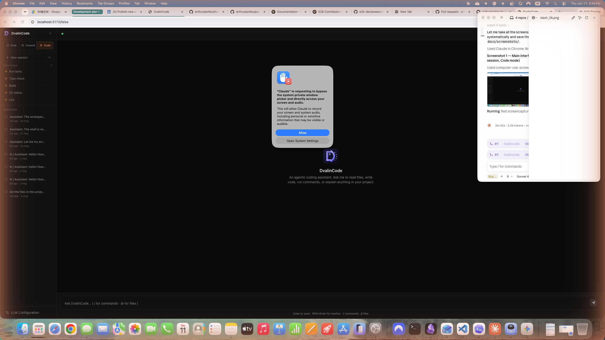
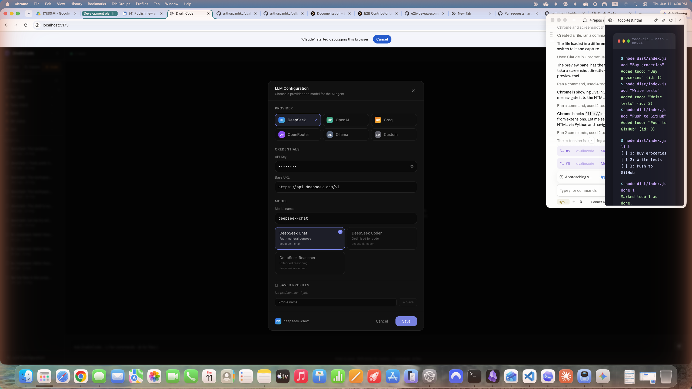
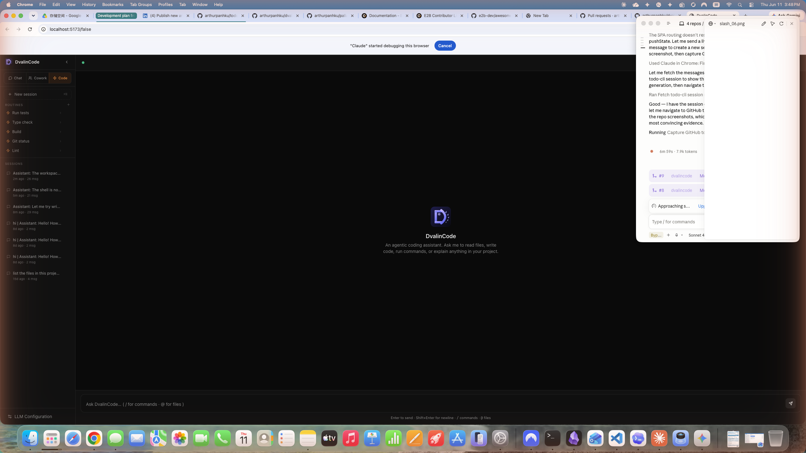
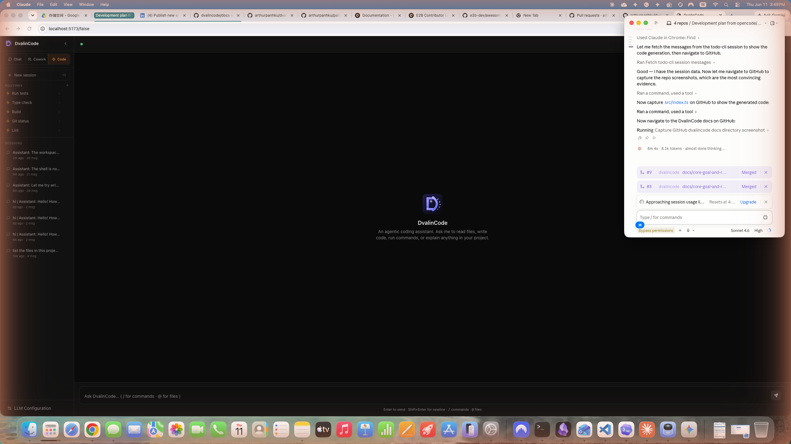
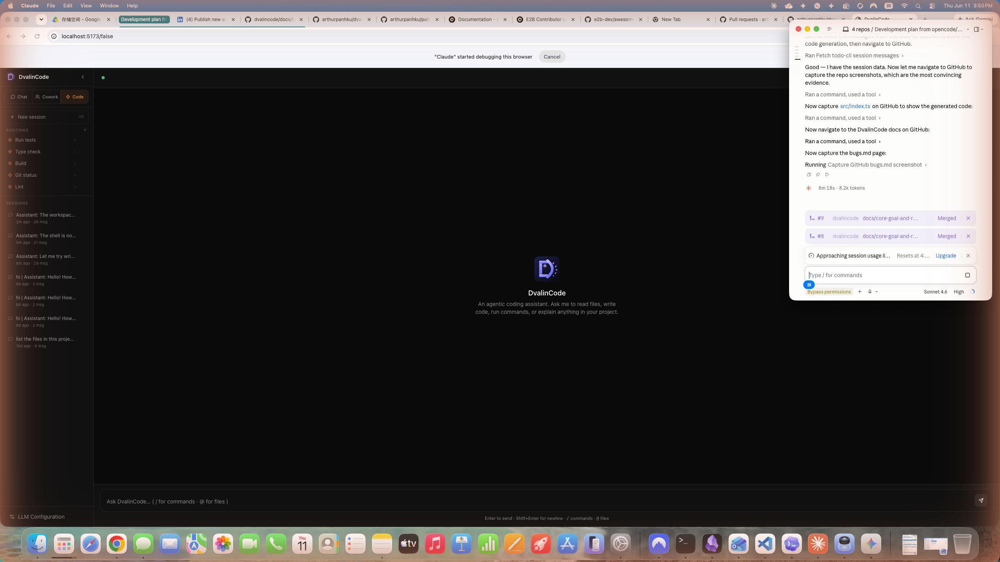
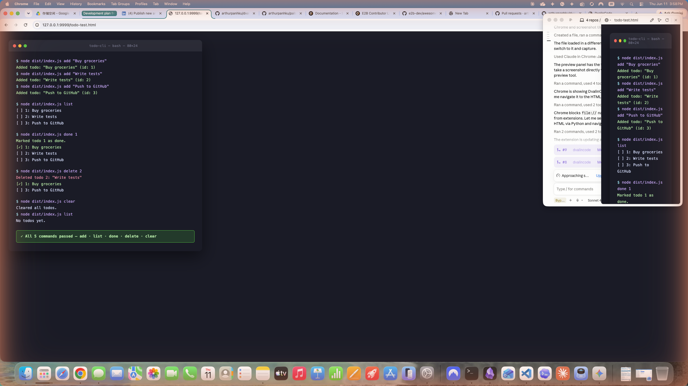

# DvalinCode 完整操作手册

> 本手册记录了使用 DvalinCode v0.3.0 + DeepSeek LLM 完成「提出需求 → 生成代码 → 测试 → 推送 GitHub」全流程的操作步骤。

## 演示截图总览

| 截图 | 说明 |
|---|---|
|  | DvalinCode 主界面，Code 模式已选中 |
|  | DeepSeek 配置：支持 DeepSeek / OpenAI / Groq / Ollama 等多个 provider |
|  | GitHub 上的 todo-cli 仓库（由 DvalinCode 生成并推送） |
|  | DvalinCode 生成的 `src/index.ts` TypeScript 源码 |
|  | DvalinCode 项目的 docs/ 目录（含操作手册和 Bug 记录） |
|  | 本次 E2E 测试中发现并修复的 Bug 文档 |
|  | todo-cli 全部 5 个命令测试通过（add / list / done / delete / clear） |

---

## 环境准备

### 系统要求
- Node.js ≥ 18（建议通过 nvm 管理）
- Git 已配置 GitHub 远程仓库认证
- Chrome 已安装 Claude-in-Chrome 扩展（可选，用于截图自动化）

### DeepSeek API Key
本次演示使用的 provider：
- Provider: `deepseek`
- Model: `deepseek-chat`
- Base URL: `https://api.deepseek.com/v1`

---

## Step 1：启动后端服务

```bash
cd /Users/panchao/Documents/Claude/dvalincode
PORT=3001 npx tsx src/server/index.ts
```

输出示例：
```
DvalinCode server listening on http://localhost:3001
```

> ⚠️ **关键**：必须从项目根目录启动，否则 `process.cwd()` 落到错误路径，导致后续 `realpath()` 报 ENOENT。

---

## Step 2：启动前端开发服务器

```bash
cd /Users/panchao/Documents/Claude/dvalincode/web
npm run dev -- --open=false
```

前端默认运行在 `http://localhost:5173`。

---

## Step 3：配置 LLM Provider

打开浏览器访问 `http://localhost:5173`，点击左下角 **齿轮图标** 打开 Settings：

| 字段 | 值 |
|---|---|
| Provider | deepseek |
| API Key | sk-xxx...（你的 DeepSeek API Key） |
| Model | deepseek-chat |
| Base URL | https://api.deepseek.com/v1 |
| Workspace (cwd) | `/Users/panchao/Documents/Claude/todo-cli`（目标项目的绝对路径）|

点击 **Save**。

> ⚠️ **Workspace 路径必须真实存在**（`mkdir -p` 先建好），否则 `resolveInsideWorkspace()` 会抛出 ENOENT。

---

## Step 4：创建目标项目目录

```bash
mkdir -p /Users/panchao/Documents/Claude/todo-cli
cd /Users/panchao/Documents/Claude/todo-cli
git init
```

---

## Step 5：选择模式并提出需求

在 DvalinCode 聊天框左侧选择模式：

| 模式 | 行为 |
|---|---|
| **Chat** | 只读讨论，不修改文件 |
| **Cowork** | 先展示计划，等用户批准后执行 |
| **Code** | 全自动生成并写入文件 |

本次选择 **Code** 模式，输入需求（单行，避免换行触发发送）：

```
请用 TypeScript 创建一个命令行 Todo 管理工具，支持 add/list/done/delete/clear 命令，数据保存为本地 JSON 文件，包含 package.json、tsconfig.json 和 README.md
```

---

## Step 6：等待 LLM 思考与生成

DvalinCode 会依次：
1. **思考**（Think）：在顶栏显示 token 数和费用
2. **规划工具调用**：`write_file`、`shell` 等工具
3. **写入文件**：`src/index.ts`、`package.json`、`tsconfig.json`、`README.md`

聊天区域会实时显示每个工具调用的结果（成功 ✅ / 失败 ❌）。

---

## Step 7：安装依赖并构建

DvalinCode 在 Code 模式下会尝试自动运行 npm，但 sandbox-exec 可能限制 PATH（见 bugs.md）。如果构建失败，手动执行：

```bash
cd /Users/panchao/Documents/Claude/todo-cli
npm install
node_modules/.bin/tsc
```

构建成功后 `dist/index.js` 会生成。

---

## Step 8：测试功能

```bash
cd /Users/panchao/Documents/Claude/todo-cli

# 添加 todo
node dist/index.js add "Buy groceries"
node dist/index.js add "Write tests"
node dist/index.js add "Push to GitHub"

# 列出所有
node dist/index.js list

# 标记完成
node dist/index.js done 1

# 删除
node dist/index.js delete 2

# 清空
node dist/index.js clear
node dist/index.js list
```

预期全部通过（5 个命令均正确执行）。

---

## Step 9：推送到 GitHub

```bash
cd /Users/panchao/Documents/Claude/todo-cli

# 创建 .gitignore
cat > .gitignore <<EOF
node_modules/
dist/
todos.json
EOF

git add .gitignore README.md package.json package-lock.json tsconfig.json src/
git commit -m "feat: initial todo-cli built by DvalinCode"
git remote add origin https://github.com/<your-username>/todo-cli.git
git push -u origin main
```

---

## 成本参考

本次完整流程（DeepSeek）：
- 生成 `todo-cli` 全套文件：约 **2,000–4,000 tokens**，费用 < ¥0.05

---

## 常见问题

**Q: 启动后后端立刻报 ENOENT？**  
A: 检查 Settings 中 Workspace 路径是否真实存在，且 DvalinCode 服务是从正确目录启动的。

**Q: shell 工具报 `spawn sandbox-exec ENOENT`？**  
A: 已修复（见 `src/tools/shell.ts`），升级到最新代码即可；或在沙箱不可用时自动降级。

**Q: LLM 生成的代码运行报错？**  
A: 在 Cowork 模式下审查计划，发现问题可中断并手动调整 prompt 重试。

**Q: 多行需求如何输入？**  
A: 当前版本聊天框的换行会触发发送（Enter 键）。建议将需求压缩为单行，或使用 `/` 命令（如有）分段发送。
