# DvalinCode End-to-End POC: Plan and Build a Snake HTML Game

This POC shows DvalinCode creating a small browser game end to end: select a workspace, plan the work, build the file, and run the generated result.

## Result

- Project folder: [`snake-html-game`](./snake-html-game/)
- Generated app: [`snake-html-game/index.html`](./snake-html-game/index.html)
- Runtime: single-file HTML, CSS, and JavaScript. No build step required.

To run it locally:

```sh
cd poc/snake-html-game
python3 -m http.server 8100
```

Then open `http://localhost:8100`.

## Flow Summary

1. Open DvalinCode Web GUI.
2. Set the workspace to `poc/snake-html-game`.
3. Use Code mode with **Plan Mode** to ask for an implementation plan.
4. Switch to **Auto Mode**.
5. Ask DvalinCode to build the planned single-file Snake game.
6. DvalinCode writes `index.html`.
7. Open the generated game in a browser and verify it runs.

## Screenshots

### 1. DvalinCode Web GUI

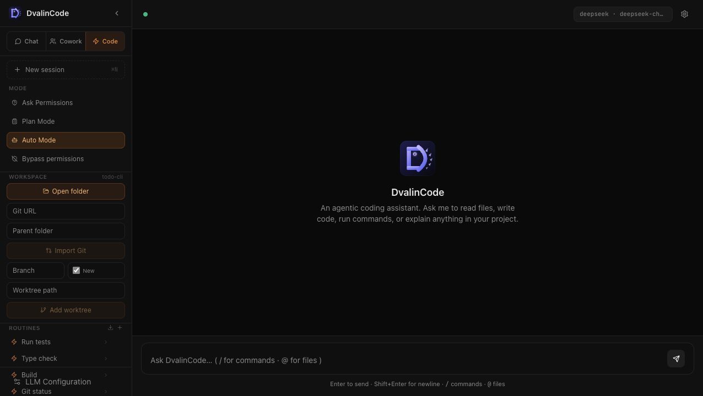

### 2. Set Workspace

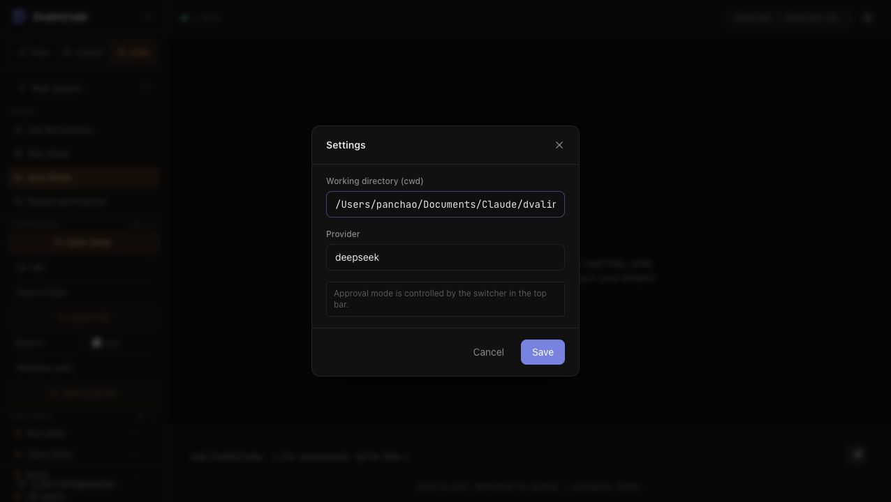

### 3. Workspace Selected

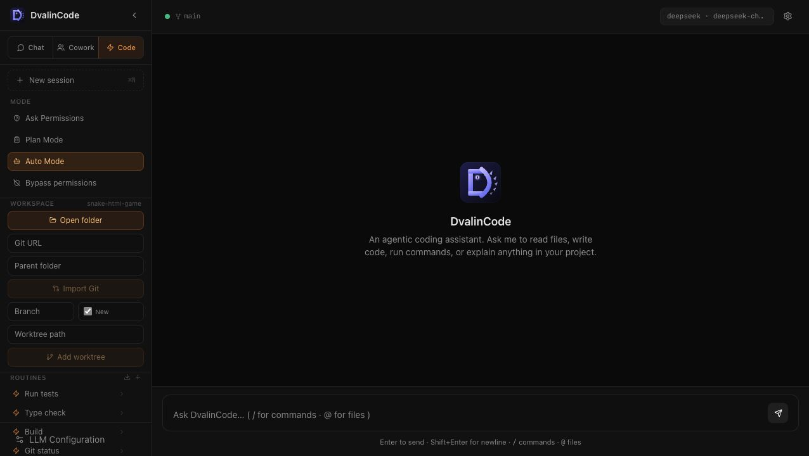

### 4. Select Plan Mode

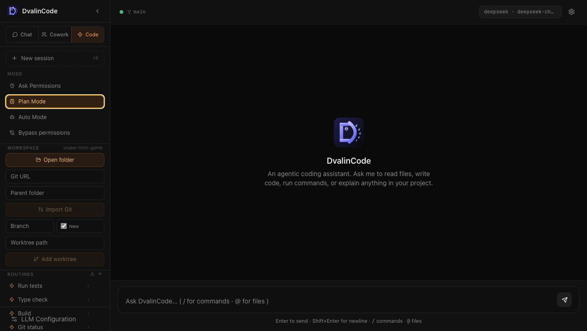

### 5. Plan Prompt

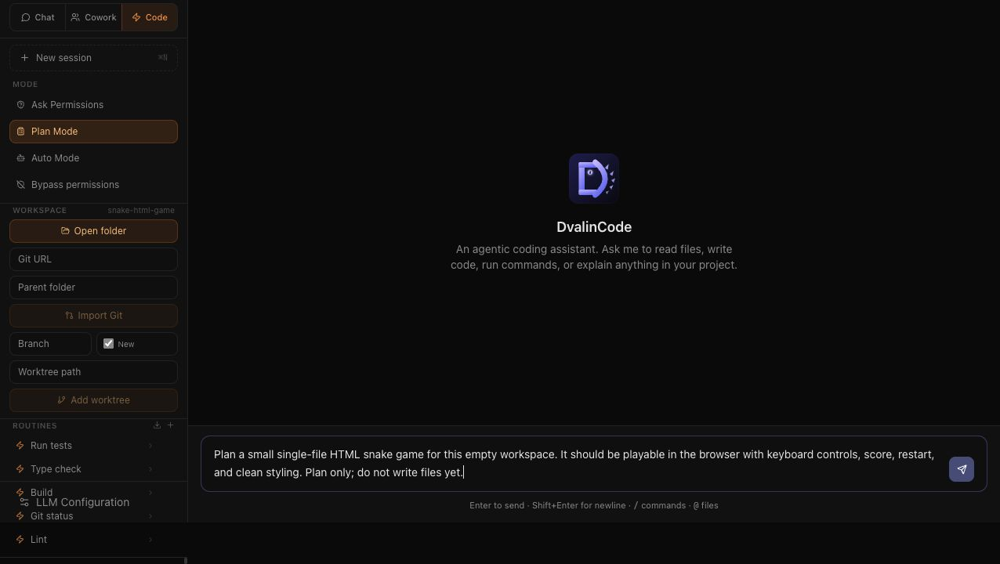

### 6. Plan Running

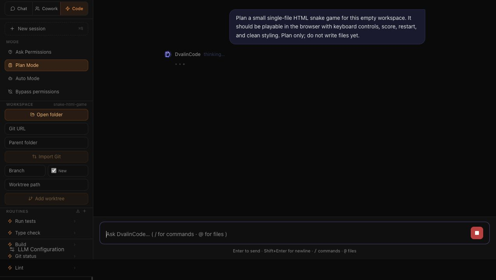

### 7. Plan Result

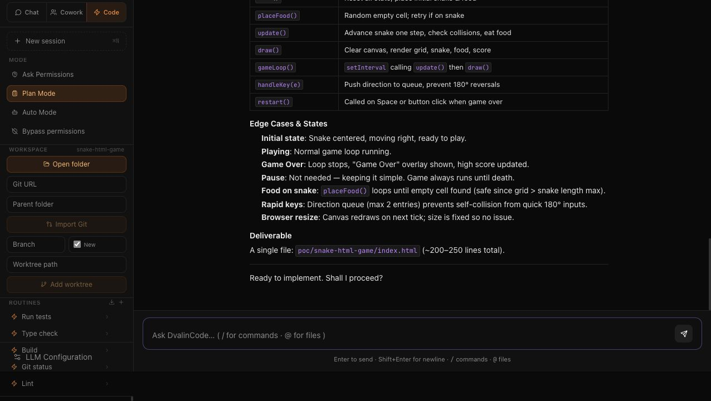

### 8. Select Auto Mode

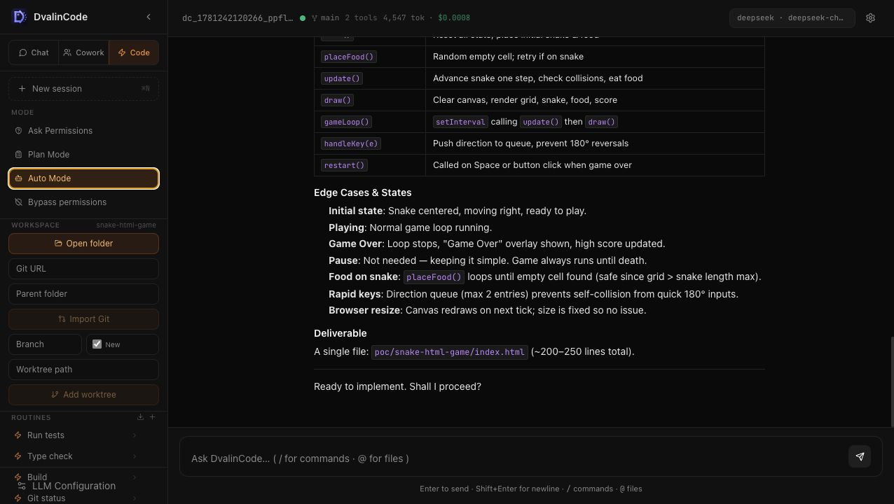

### 9. Build Prompt

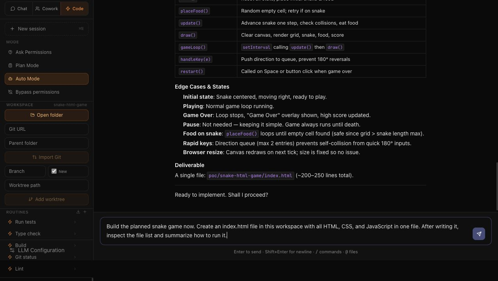

### 10. Build Running

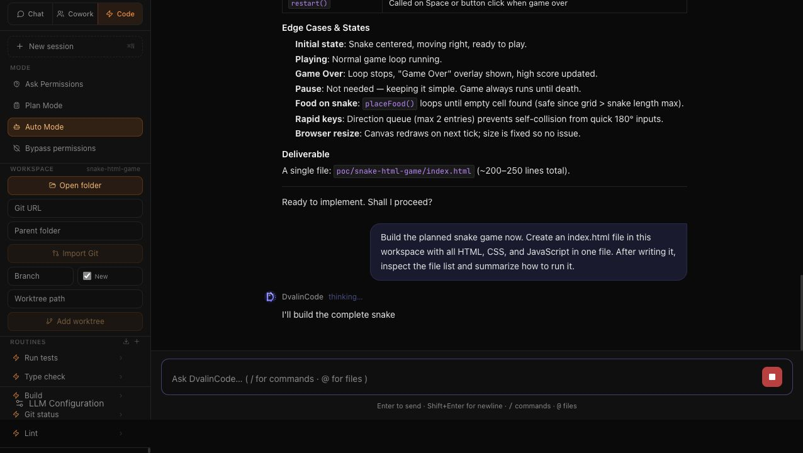

### 11. Build Result

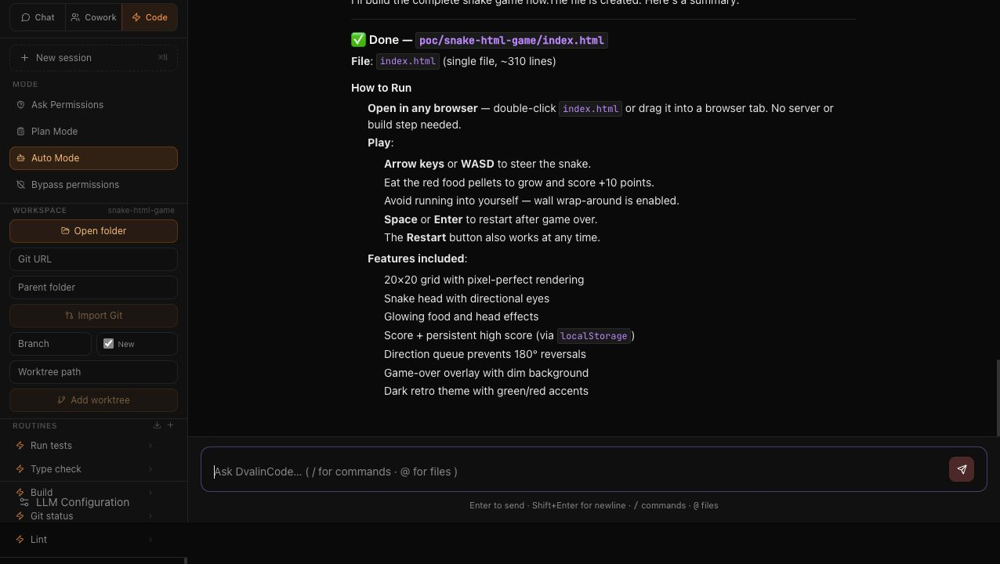

### 12. Generated Game Opened

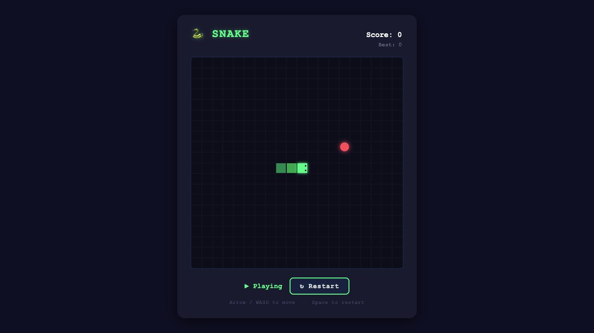

### 13. Generated Game Playing

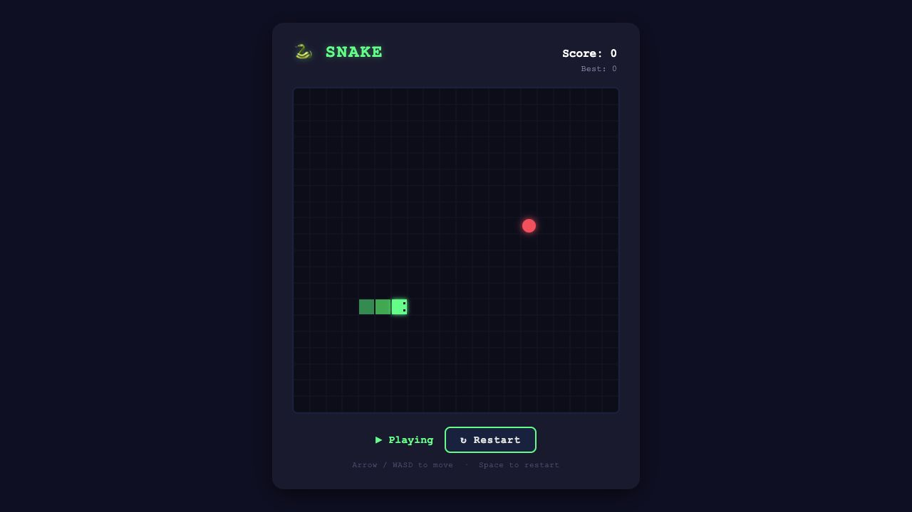

## Notes

- The workspace and generated file were created in `poc/snake-html-game`.
- The planning step used DvalinCode Code mode with **Plan Mode**.
- The implementation step used DvalinCode Code mode with **Auto Mode**.
- The generated app was verified in a browser after serving the project with Python's built-in HTTP server.
